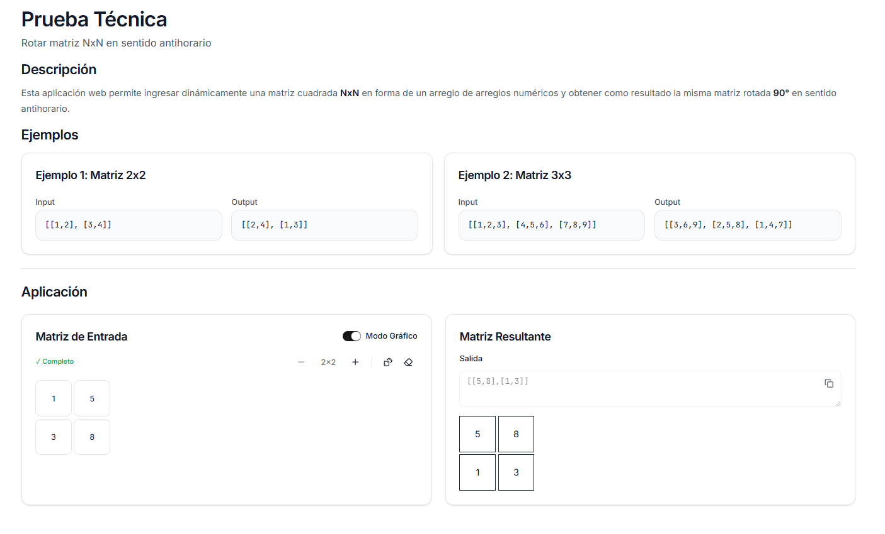

# Prueba Técnica - Rotar Matriz NxN

Aplicación web interactiva para rotar matrices cuadradas NxN 90 grados en sentido antihorario.



## 📋 Descripción

Esta aplicación web permite ingresar dinámicamente una matriz cuadrada NxN en forma de un arreglo de arreglos numéricos y obtener como resultado la misma matriz rotada 90° en sentido antihorario.

## 🚀 Ejemplos

### Ejemplo 1: Matriz 2x2

**Input:**
```json
[[1,2], [3,4]]
```

**Output:**
```json
[[2,4], [1,3]]
```

### Ejemplo 2: Matriz 3x3

**Input:**
```json
[[1,2,3], [4,5,6], [7,8,9]]
```

**Output:**
```json
[[3,6,9], [2,5,8], [1,4,7]]
```

## 🛠️ Tecnologías

- [Next.js](https://nextjs.org) 16.1.4
- [React](https://react.dev) 19.2.3
- [TypeScript](https://www.typescriptlang.org)
- [Tailwind CSS](https://tailwindcss.com) 4
- [Vitest](https://vitest.dev) para testing
- [Radix UI](https://www.radix-ui.com) para componentes

## 📦 Instalación

1. Clona el repositorio:
```bash
git clone <url-del-repositorio>
cd matrix-rotation-technical-test
```

2. Instala las dependencias:
```bash
npm install
# o
pnpm install
# o
yarn install
```

## 🏃 Ejecución

### Desarrollo

```bash
npm run dev
# o
pnpm dev
# o
yarn dev
```

Abre [http://localhost:3000](http://localhost:3000) en tu navegador.

### Producción

```bash
npm run build
npm run start
```

## 🧪 Testing

```bash
# Ejecutar tests
npm run test

# Tests con interfaz UI
npm run test:ui

# Tests en modo CI
npm run test:run

# Tests con cobertura
npm run test:coverage
```

## 📝 Scripts Disponibles

- `dev` - Inicia el servidor de desarrollo
- `build` - Construye la aplicación para producción
- `start` - Inicia el servidor de producción
- `lint` - Ejecuta el linter
- `format` - Formatea el código con Prettier
- `format:check` - Verifica el formato del código
- `test` - Ejecuta los tests en modo watch
- `test:ui` - Ejecuta los tests con interfaz gráfica
- `test:run` - Ejecuta los tests una vez
- `test:coverage` - Genera reporte de cobertura

## 🌐 Demo en Vivo

Visita la aplicación en producción: [https://matrix-rotation-technical-test.vercel.app](https://matrix-rotation-technical-test.vercel.app)

## 📄 Licencia

Este proyecto es una prueba técnica.
